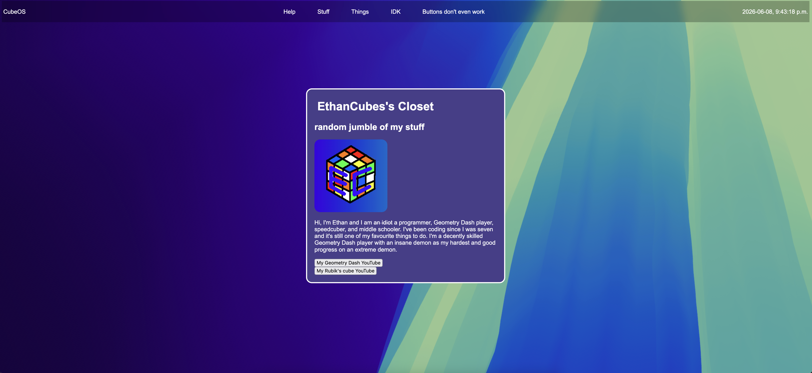

CubeOS
A web-based "operating system" that also acts like a portfolio.

## [Click Here for Live Demo](https://ethancubes.neocities.org/)

## Credits
- The WebOS tutorial included with the WebOS mission, created by SerenityUX, single-handely carried this entire project. (I did have my own ideas but mostly the layout came from the tutorial)
- Lowkey stole macosWallpaper.png from Apple (hope they don't mind)